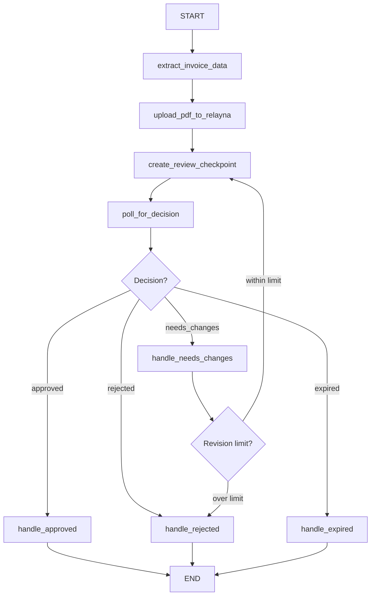

# LangGraph × Relayna — PDF Invoice Human Review Demo

A working example showing how to integrate [Relayna](https://relayna.ai) with [LangGraph](https://langchain-ai.github.io/langgraph/) to add a human-in-the-loop approval step into an AI-powered invoice processing workflow.

## What this demo does

```
PDF Invoice
    │
    ▼
Claude extracts structured data (vendor, amount, line items…)
    │
    ▼
PDF uploaded to Relayna asset storage
    │
    ▼
Relayna review checkpoint created → magic link generated
    │
    ▼
[Human opens link, reviews PDF + extracted data, makes decision]
    │
    ├── Approved       → simulate payment processing → done
    ├── Rejected       → log reason → done
    ├── Needs changes  → Claude applies corrections → loop back ↑
    └── Expired        → log timeout → done
```

## Graph topology



## Prerequisites

- Python 3.11+
- A running Relayna instance ([run locally](../../README.md) or use the hosted version)
- An Anthropic API key

## Setup

### 1. Install dependencies

```bash
# Using uv (recommended)
uv venv && uv pip install -e .
source .venv/bin/activate   # Windows: .venv\Scripts\activate

# Or with pip
python -m venv .venv
source .venv/bin/activate   # Windows: .venv\Scripts\activate
pip install -e .
```

### 2. Configure environment

```bash
cp .env.example .env
```

Edit `.env`:

```
RELAYNA_BASE_URL=https://relayna.app      # your Relayna URL
RELAYNA_API_KEY=relayna:your_key_here     # from /dashboard/api-keys
ANTHROPIC_API_KEY=sk-ant-...             # your Claude API key
```

### 3. Create an API key in Relayna

1. Start Relayna: `mix phx.server` (from the repo root)
2. Register an account at `https://relayna.app`
3. Go to **Dashboard → API Keys → New Key**
4. Copy the key into your `.env`

## Usage

### Generate a sample invoice

```bash
python scripts/generate_invoice.py
# Creates: invoice.pdf

python scripts/generate_invoice.py --output my_invoice.pdf --vendor "Globex Corp"
```

### Run the workflow (polling mode — default)

```bash
python main.py --invoice invoice.pdf
```

The workflow will:
1. Extract invoice data using Claude
2. Upload the PDF to Relayna
3. Print a **review URL** — open it in your browser
4. Poll every 15 seconds for your decision
5. Print the final outcome

### Run with webhook mode

Instead of polling, Relayna will push the decision to your local server:

```bash
python main.py --invoice invoice.pdf --webhook
```

Requires `WEBHOOK_CALLBACK_URL=http://localhost:8765/webhook` in `.env`.
For remote Relayna instances, use a tunnel like [ngrok](https://ngrok.com):
```bash
ngrok http 8765
# Then set WEBHOOK_CALLBACK_URL=https://your-ngrok-url.ngrok.io/webhook
```

### Print the graph

```bash
python main.py --print-graph
```

## Configuration

| Variable | Default | Description |
|---|---|---|
| `RELAYNA_BASE_URL` | — | Relayna instance URL (required) |
| `RELAYNA_API_KEY` | — | API key from dashboard (required) |
| `ANTHROPIC_API_KEY` | — | Claude API key (required) |
| `POLL_INTERVAL_SECONDS` | `15` | How often to check checkpoint status |
| `MAX_REVISIONS` | `2` | Max needs_changes loops before giving up |
| `CHECKPOINT_TTL_SECONDS` | `86400` | How long the review link stays valid (24h) |
| `WEBHOOK_PORT` | `8765` | Local webhook server port |
| `WEBHOOK_CALLBACK_URL` | `http://localhost:8765/webhook` | URL Relayna posts decisions to |

## File structure

```
langgraph-invoice-review/
├── main.py                         # CLI entry point
├── pyproject.toml                  # Dependencies
├── .env.example                    # Environment template
├── invoice_review/
│   ├── state.py                    # InvoiceState TypedDict
│   ├── relayna_client.py           # httpx wrapper for Relayna API
│   ├── nodes.py                    # LangGraph node functions
│   ├── graph.py                    # StateGraph wiring
│   └── webhook_server.py           # Optional FastAPI webhook receiver
└── scripts/
    └── generate_invoice.py         # Sample PDF invoice generator
```

## Relayna API used

| Endpoint | Purpose |
|---|---|
| `POST /api/assets/upload` | Upload the PDF invoice |
| `POST /api/checkpoints` | Create human review checkpoint + magic link |
| `GET /api/checkpoints/:id/status` | Poll for reviewer decision |
| `POST /api/checkpoints/:id/cancel` | Cancel if workflow aborts |

The human reviewer receives a magic link (`/r/:token`) — **no account or login required**. They see the original PDF and the Claude-extracted data side by side, then click Approve / Reject / Request Changes.

## Extending this demo

- **Real payment processing**: Replace `handle_approved` with calls to your payment gateway (Stripe, Bill.com, etc.)
- **Notification**: Add Slack/email notification in `create_review_checkpoint` after printing the URL
- **Structured corrections**: The `needs_changes` node uses Claude to apply reviewer corrections — extend `edited_fields` in the Relayna decision payload for more precise structured edits
- **Parallel reviews**: Use LangGraph's `Send` API to fan out to multiple reviewers simultaneously
